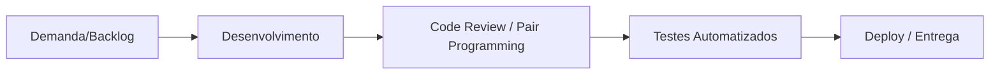

# Relatório de Qualidade de Processo - LocalEats

**Integrantes do Grupo:**
* Douglas Santos
* Mauricio T. Welter

---

## 1. Mapeamento do Processo Atual

Para o desenvolvimento do LocalEats, adotamos um fluxo baseado em **Kanban simplificado**, priorizando a agilidade e a entrega contínua, visando otimizar o tempo frente a outras demandas acadêmicas do semestre.

---

## 2. Identificação de Entradas, Atividades e Saídas

Com base no fluxo de trabalho estabelecido, mapeamos as principais etapas, entradas e saídas do processo de desenvolvimento:

| Etapa | Entrada | Atividade | Saída |
| :--- | :--- | :--- | :--- |
| **Planejamento** | Requisitos do PBL | Definição de tarefas (Issues) | Backlog organizado |
| **Desenvolvimento** | Tarefa atribuída | Implementação do código (TDD) | Código fonte funcional |
| **Code Review** | Código desenvolvido | Revisão entre pares | Código aprovado/Refatorado |
| **Testes** | Código revisado | Execução de testes automatizados | Relatório de cobertura/sucesso |
| **Entrega** | Build aprovada | Deploy contínuo (Vercel) | Aplicação em produção |

---

## 3. Reflexão sobre o Processo

* **O processo utilizado pela equipe está claramente definido?**
  Sim. Utilizamos um fluxo linear e simplificado, focado em evitar burocracias desnecessárias e garantir que cada etapa cumpra seu papel básico de verificação antes da integração final.

* **Todos os integrantes seguem o mesmo fluxo de trabalho?**
  Sim. O fluxo é compartilhado via repositório. Como temos outras demandas intensas (como projetos de IA e o FitTrack), o processo enxuto garante que, independente de quem esteja codificando, o padrão mínimo de qualidade seja mantido.

* **Em quais etapas a qualidade é verificada?**
  A qualidade é verificada principalmente no *Code Review* (validação humana) e na execução de testes automatizados antes do merge (validação técnica).

* **Quais melhorias poderiam tornar o processo mais eficiente?**
  Poderíamos automatizar ainda mais o *linting* no momento do commit e implementar ferramentas de análise estática de código para reduzir o tempo gasto em revisões manuais.

* **Como a qualidade do processo impacta a qualidade do produto final?**
  Um processo bem definido, mesmo que enxuto, reduz a carga cognitiva dos desenvolvedores. Ao garantir que o código passe por testes básicos antes do deploy, evitamos bugs críticos, permitindo que a equipe foque sua energia em funcionalidades complexas sem sacrificar a estabilidade do LocalEats.